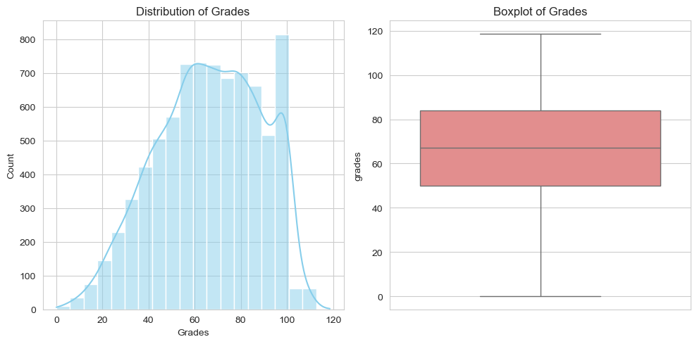
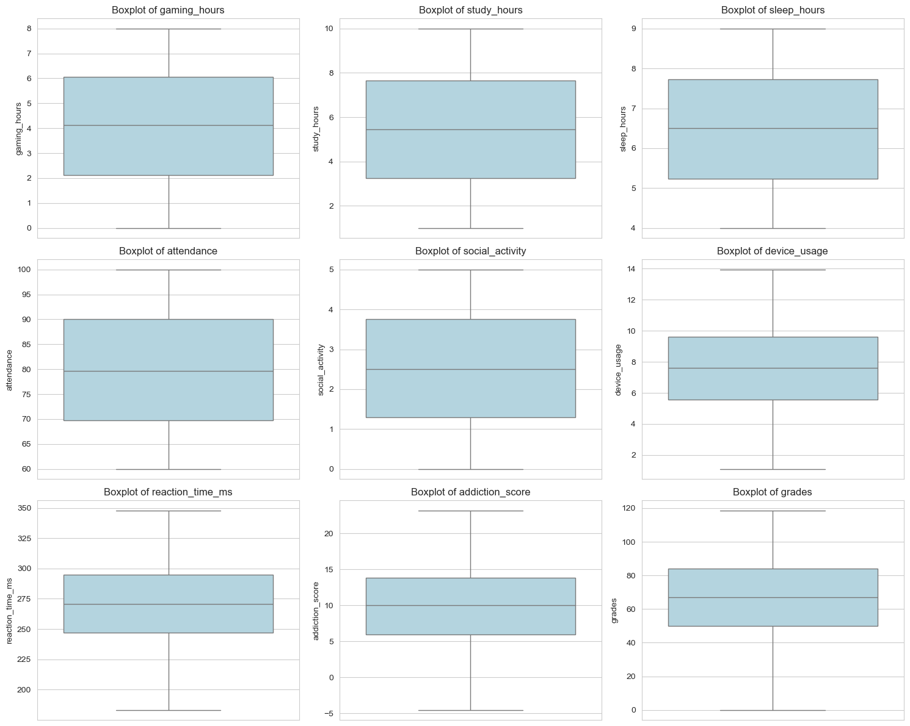
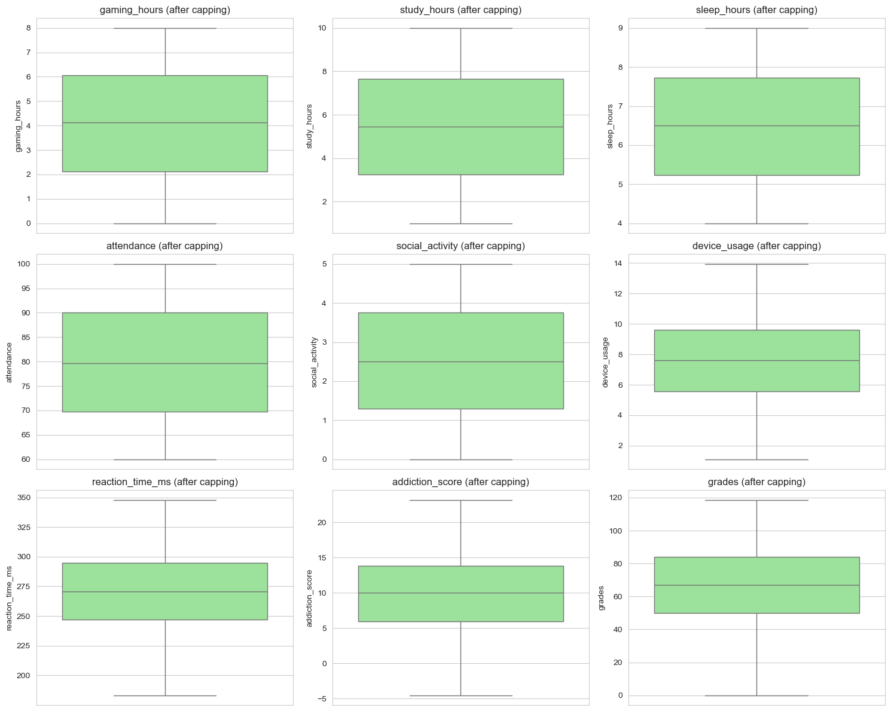
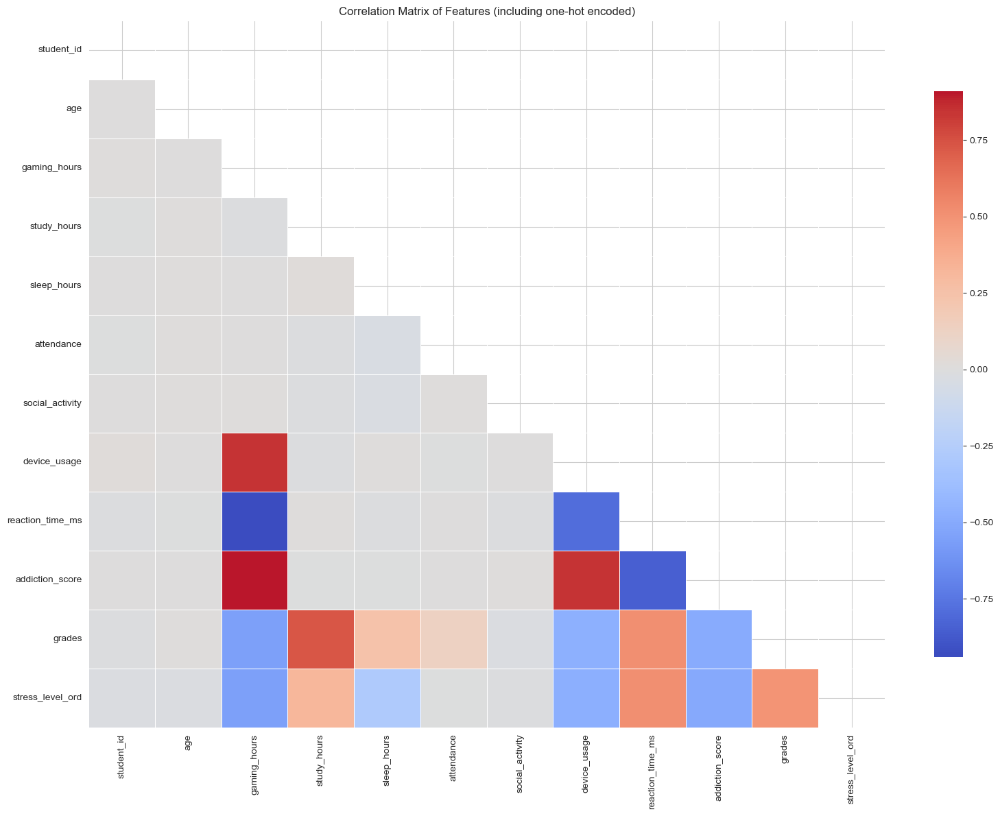
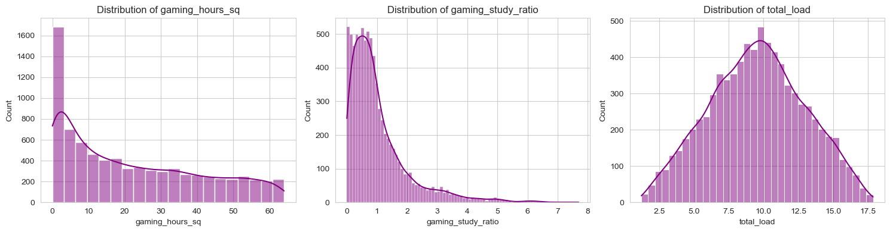

# Stage 1 – Data Preprocessing & Feature Engineering

Goal: Clean raw data, construct features, perform stratified train/test split, standardize, and save processed data.

# 1. Import Libraries & Configuration


```python
import pandas as pd
import numpy as np
import pickle
import matplotlib.pyplot as plt
import seaborn as sns
from sklearn.model_selection import train_test_split
from sklearn.preprocessing import StandardScaler
import os

# Set paths
DATA_RAW = '../data/Gaming_Academic_Performance.csv'
PROCESSED_DIR = '../data/processed/'
os.makedirs(PROCESSED_DIR, exist_ok=True)

# Plot style
sns.set_style("whitegrid")
plt.rcParams['figure.figsize'] = (10, 6)
```


```python
pd.set_option('display.max_columns', None)
pd.set_option('display.width', None)
```

**Explanation:**  
Imports including matplotlib and seaborn for visualization. Sets up output directory and plotting style.

## 2. Load Raw Data


```python
df = pd.read_csv(DATA_RAW)
print(f"Raw data shape: {df.shape}")
print(f"Columns: {df.columns.tolist()}\n")
print("First 5 rows preview:")
df.head()
```

    Raw data shape: (8000, 14)
    Columns: ['student_id', 'age', 'gender', 'gaming_hours', 'study_hours', 'sleep_hours', 'attendance', 'gaming_genre', 'social_activity', 'device_usage', 'reaction_time_ms', 'addiction_score', 'stress_level', 'grades']
    
    First 5 rows preview:
    


<div>
<style scoped>
    .dataframe tbody tr th:only-of-type {
        vertical-align: middle;
    }

    .dataframe tbody tr th {
        vertical-align: top;
    }

    .dataframe thead th {
        text-align: right;
    }
</style>
<table border="1" class="dataframe">
  <thead>
    <tr style="text-align: right;">
      <th></th>
      <th>student_id</th>
      <th>age</th>
      <th>gender</th>
      <th>gaming_hours</th>
      <th>study_hours</th>
      <th>sleep_hours</th>
      <th>attendance</th>
      <th>gaming_genre</th>
      <th>social_activity</th>
      <th>device_usage</th>
      <th>reaction_time_ms</th>
      <th>addiction_score</th>
      <th>stress_level</th>
      <th>grades</th>
    </tr>
  </thead>
  <tbody>
    <tr>
      <th>0</th>
      <td>1</td>
      <td>22</td>
      <td>Male</td>
      <td>7.23</td>
      <td>8.78</td>
      <td>6.96</td>
      <td>91.44</td>
      <td>FPS</td>
      <td>3.25</td>
      <td>9.36</td>
      <td>235.84</td>
      <td>14.69</td>
      <td>Low</td>
      <td>86.459555</td>
    </tr>
    <tr>
      <th>1</th>
      <td>2</td>
      <td>19</td>
      <td>Male</td>
      <td>0.07</td>
      <td>8.72</td>
      <td>7.63</td>
      <td>63.63</td>
      <td>Casual</td>
      <td>1.02</td>
      <td>3.21</td>
      <td>328.71</td>
      <td>2.47</td>
      <td>Medium</td>
      <td>98.230000</td>
    </tr>
    <tr>
      <th>2</th>
      <td>3</td>
      <td>23</td>
      <td>Female</td>
      <td>1.73</td>
      <td>9.56</td>
      <td>4.40</td>
      <td>83.26</td>
      <td>Casual</td>
      <td>3.46</td>
      <td>5.56</td>
      <td>313.61</td>
      <td>4.73</td>
      <td>High</td>
      <td>90.560000</td>
    </tr>
    <tr>
      <th>3</th>
      <td>4</td>
      <td>20</td>
      <td>Female</td>
      <td>6.62</td>
      <td>1.68</td>
      <td>7.83</td>
      <td>75.04</td>
      <td>RPG</td>
      <td>1.46</td>
      <td>11.78</td>
      <td>241.84</td>
      <td>14.54</td>
      <td>Low</td>
      <td>32.670000</td>
    </tr>
    <tr>
      <th>4</th>
      <td>5</td>
      <td>22</td>
      <td>Female</td>
      <td>5.36</td>
      <td>5.83</td>
      <td>5.55</td>
      <td>65.57</td>
      <td>FPS</td>
      <td>1.01</td>
      <td>8.23</td>
      <td>249.31</td>
      <td>12.48</td>
      <td>Low</td>
      <td>58.710000</td>
    </tr>
  </tbody>
</table>
</div>


**Expected output:**  
The shape (number of rows and columns), the list of column names, and the first 5 rows of the dataset are printed. This gives an initial understanding of the data structure.

## 3. Data Types & Missing Values


```python
plt.figure(figsize=(10, 5))
plt.subplot(1, 2, 1)
sns.histplot(df['grades'], bins=20, kde=True, color='skyblue')
plt.title('Distribution of Grades')
plt.xlabel('Grades')

plt.subplot(1, 2, 2)
sns.boxplot(y=df['grades'], color='lightcoral')
plt.title('Boxplot of Grades')
plt.tight_layout()
plt.show()
```


    

    


**Interpretation:**  
Histogram + KDE shows whether grades are normally distributed. Boxplot reveals outliers (which will be capped later). Helps decide if transformation is needed.

## 4. Data Types & Missing Values


```python
print("Data types:")
print(df.dtypes)
print("\nMissing value count:")
print(df.isnull().sum())
print(f"\nNumber of duplicate rows: {df.duplicated().sum()}")
```

    Data types:
    student_id            int64
    age                   int64
    gender               object
    gaming_hours        float64
    study_hours         float64
    sleep_hours         float64
    attendance          float64
    gaming_genre         object
    social_activity     float64
    device_usage        float64
    reaction_time_ms    float64
    addiction_score     float64
    stress_level         object
    grades              float64
    dtype: object
    
    Missing value count:
    student_id          0
    age                 0
    gender              0
    gaming_hours        0
    study_hours         0
    sleep_hours         0
    attendance          0
    gaming_genre        0
    social_activity     0
    device_usage        0
    reaction_time_ms    0
    addiction_score     0
    stress_level        0
    grades              0
    dtype: int64
    
    Number of duplicate rows: 0
    

**No missing values expected in this dataset.**

## 5. Descriptive Statistics


```python
df.describe()
```


<div>
<style scoped>
    .dataframe tbody tr th:only-of-type {
        vertical-align: middle;
    }

    .dataframe tbody tr th {
        vertical-align: top;
    }

    .dataframe thead th {
        text-align: right;
    }
</style>
<table border="1" class="dataframe">
  <thead>
    <tr style="text-align: right;">
      <th></th>
      <th>student_id</th>
      <th>age</th>
      <th>gaming_hours</th>
      <th>study_hours</th>
      <th>sleep_hours</th>
      <th>attendance</th>
      <th>social_activity</th>
      <th>device_usage</th>
      <th>reaction_time_ms</th>
      <th>addiction_score</th>
      <th>grades</th>
    </tr>
  </thead>
  <tbody>
    <tr>
      <th>count</th>
      <td>8000.00000</td>
      <td>8000.000000</td>
      <td>8000.000000</td>
      <td>8000.000000</td>
      <td>8000.000000</td>
      <td>8000.000000</td>
      <td>8000.000000</td>
      <td>8000.000000</td>
      <td>8000.000000</td>
      <td>8000.000000</td>
      <td>8000.000000</td>
    </tr>
    <tr>
      <th>mean</th>
      <td>4000.50000</td>
      <td>19.983625</td>
      <td>4.085773</td>
      <td>5.460581</td>
      <td>6.493453</td>
      <td>79.886525</td>
      <td>2.507790</td>
      <td>7.586315</td>
      <td>271.105839</td>
      <td>9.908492</td>
      <td>66.180776</td>
    </tr>
    <tr>
      <th>std</th>
      <td>2309.54541</td>
      <td>2.587072</td>
      <td>2.308801</td>
      <td>2.575787</td>
      <td>1.442656</td>
      <td>11.580419</td>
      <td>1.441128</td>
      <td>2.710035</td>
      <td>29.440675</td>
      <td>5.035837</td>
      <td>22.422024</td>
    </tr>
    <tr>
      <th>min</th>
      <td>1.00000</td>
      <td>16.000000</td>
      <td>0.000000</td>
      <td>1.000000</td>
      <td>4.000000</td>
      <td>60.000000</td>
      <td>0.000000</td>
      <td>1.100000</td>
      <td>183.260000</td>
      <td>-4.510000</td>
      <td>0.000000</td>
    </tr>
    <tr>
      <th>25%</th>
      <td>2000.75000</td>
      <td>18.000000</td>
      <td>2.130000</td>
      <td>3.240000</td>
      <td>5.240000</td>
      <td>69.780000</td>
      <td>1.287500</td>
      <td>5.560000</td>
      <td>247.160000</td>
      <td>5.920000</td>
      <td>49.879843</td>
    </tr>
    <tr>
      <th>50%</th>
      <td>4000.50000</td>
      <td>20.000000</td>
      <td>4.130000</td>
      <td>5.460000</td>
      <td>6.505000</td>
      <td>79.695000</td>
      <td>2.500000</td>
      <td>7.610000</td>
      <td>270.475000</td>
      <td>10.005000</td>
      <td>67.070000</td>
    </tr>
    <tr>
      <th>75%</th>
      <td>6000.25000</td>
      <td>22.000000</td>
      <td>6.060000</td>
      <td>7.660000</td>
      <td>7.730000</td>
      <td>90.100000</td>
      <td>3.760000</td>
      <td>9.600000</td>
      <td>294.690000</td>
      <td>13.860000</td>
      <td>83.992223</td>
    </tr>
    <tr>
      <th>max</th>
      <td>8000.00000</td>
      <td>24.000000</td>
      <td>8.000000</td>
      <td>10.000000</td>
      <td>9.000000</td>
      <td>100.000000</td>
      <td>5.000000</td>
      <td>13.950000</td>
      <td>347.870000</td>
      <td>23.160000</td>
      <td>118.632936</td>
    </tr>
  </tbody>
</table>
</div>


**Summary statistics for numerical columns.**

## 6. Check Unique Values in Categorical Variables


```python
print("gender unique values:", df['gender'].unique())
print("gaming_genre unique values:", df['gaming_genre'].unique())
print("stress_level unique values:", df['stress_level'].unique())
```

    gender unique values: ['Male' 'Female' 'Other']
    gaming_genre unique values: ['FPS' 'Casual' 'RPG']
    stress_level unique values: ['Low' 'Medium' 'High']
    

**Verifies categories before encoding.**

## 7. Outlier Detection Before Capping


```python
num_cols = ['gaming_hours', 'study_hours', 'sleep_hours', 'attendance',
            'social_activity', 'device_usage', 'reaction_time_ms',
            'addiction_score', 'grades']

fig, axes = plt.subplots(3, 3, figsize=(15, 12))
axes = axes.flatten()
for i, col in enumerate(num_cols):
    sns.boxplot(y=df[col], ax=axes[i], color='lightblue')
    axes[i].set_title(f'Boxplot of {col}')
plt.tight_layout()
plt.show()
```


    

    


**Boxplots before capping – extreme outliers visible in several features (e.g., gaming_hours, addiction_score).**

## 8. Outlier Capping (IQR method)


```python
def cap_outliers(df, cols):
    for col in cols:
        Q1 = df[col].quantile(0.25)
        Q3 = df[col].quantile(0.75)
        IQR = Q3 - Q1
        lower = Q1 - 1.5 * IQR
        upper = Q3 + 1.5 * IQR
        df[col] = df[col].clip(lower, upper)
    return df

df_before = df.copy()
df = cap_outliers(df, num_cols)

for col in num_cols:
    before_min, before_max = df_before[col].min(), df_before[col].max()
    after_min, after_max = df[col].min(), df[col].max()
    if (before_min != after_min) or (before_max != after_max):
        print(f"{col}: before capping [{before_min:.2f}, {before_max:.2f}] → after capping [{after_min:.2f}, {after_max:.2f}]")
```

**After capping, outliers are clamped. Let's visualize the effect.**


```python
fig, axes = plt.subplots(3, 3, figsize=(15, 12))
axes = axes.flatten()
for i, col in enumerate(num_cols):
    sns.boxplot(y=df[col], ax=axes[i], color='lightgreen')
    axes[i].set_title(f'{col} (after capping)')
plt.tight_layout()
plt.show()
```


    

    


**Boxplots after capping – extreme whiskers are reduced, data range more reasonable.**

## 9. Logical Consistency Checks


```python
inconsistent = (df['gaming_hours'] > df['device_usage']).sum()
print(f"Rows with gaming_hours > device_usage: {inconsistent}")
print(f"grades range: [{df['grades'].min():.2f}, {df['grades'].max():.2f}]")
print(f"gaming_hours range: [{df['gaming_hours'].min():.2f}, {df['gaming_hours'].max():.2f}]")
```

    Rows with gaming_hours > device_usage: 0
    grades range: [0.00, 118.63]
    gaming_hours range: [0.00, 8.00]
    

**Checks logical validity – gaming hours should not exceed device usage.**

## 10. Encode Categorical Variables


```python
# Gender one-hot
df = pd.get_dummies(df, columns=['gender'], prefix='gender', drop_first=True)
print("Gender one-hot columns:", [c for c in df.columns if 'gender_' in c])
```

    Gender one-hot columns: ['gender_Male', 'gender_Other']
    


```python
# Gaming genre one-hot
genre_dummies = pd.get_dummies(df['gaming_genre'], prefix='genre')
df = pd.concat([df, genre_dummies], axis=1).drop('gaming_genre', axis=1)
print("Genre one-hot columns:", genre_dummies.columns.tolist())
```

    Genre one-hot columns: ['genre_Casual', 'genre_FPS', 'genre_RPG']
    


```python
# Ordinal encoding for stress_level
stress_map = {'Low': 0, 'Medium': 1, 'High': 2}
df['stress_level_ord'] = df['stress_level'].map(stress_map)
df = df.drop('stress_level', axis=1)
print("Stress level mapping:", stress_map)
print("Distribution:\n", df['stress_level_ord'].value_counts().sort_index())
```

    Stress level mapping: {'Low': 0, 'Medium': 1, 'High': 2}
    Distribution:
     stress_level_ord
    0    2743
    1    4247
    2    1010
    Name: count, dtype: int64
    

## 11. Correlation Heatmap (after encoding)


```python
# Select numerical columns for correlation (including encoded ones)
numerical_cols = df.select_dtypes(include=[np.number]).columns.tolist()
# Remove student_id and grades for heatmap? We'll keep grades as target
corr = df[numerical_cols].corr()

plt.figure(figsize=(16, 12))
mask = np.triu(np.ones_like(corr, dtype=bool))
sns.heatmap(corr, mask=mask, annot=False, cmap='coolwarm', center=0, 
            linewidths=0.5, cbar_kws={"shrink": 0.8})
plt.title('Correlation Matrix of Features (including one-hot encoded)')
plt.tight_layout()
plt.show()
```


    

    


**Shows correlations between features and target (grades). Useful for feature selection.**

## 12. Feature Engineering


```python
df['gaming_hours_sq'] = df['gaming_hours'] ** 2
df['gaming_hours_x_FPS'] = df['gaming_hours'] * df['genre_FPS']
df['gaming_hours_x_RPG'] = df['gaming_hours'] * df['genre_RPG']
df['gaming_study_ratio'] = df['gaming_hours'] / (df['study_hours'] + 0.01)
df['total_load'] = df['gaming_hours'] + df['study_hours']

print("New features added:", ['gaming_hours_sq', 'gaming_hours_x_FPS', 'gaming_hours_x_RPG', 
                              'gaming_study_ratio', 'total_load'])
print(f"\nTotal features now: {df.shape[1]}")
```

    New features added: ['gaming_hours_sq', 'gaming_hours_x_FPS', 'gaming_hours_x_RPG', 'gaming_study_ratio', 'total_load']
    
    Total features now: 22
    


```python
# Visualize new features distributions
new_features = ['gaming_hours_sq', 'gaming_study_ratio', 'total_load']
fig, axes = plt.subplots(1, 3, figsize=(15, 4))
for i, feat in enumerate(new_features):
    sns.histplot(df[feat], kde=True, ax=axes[i], color='purple')
    axes[i].set_title(f'Distribution of {feat}')
plt.tight_layout()
plt.show()
```


    

    


**New features: squared gaming hours (non-linear), gaming/study ratio, total load. Their distributions are right-skewed as expected.**

## 13. Train-Test Split (Stratified by stress_level_ord)


```python
X = df.drop(['student_id', 'grades'], axis=1)
y = df['grades']

X_train, X_test, y_train, y_test = train_test_split(
    X, y, test_size=0.2, random_state=42, stratify=df['stress_level_ord']
)

print(f"Train X: {X_train.shape}, Test X: {X_test.shape}")
print(f"Train y: {y_train.shape}, Test y: {y_test.shape}")
```

    Train X: (6400, 20), Test X: (1600, 20)
    Train y: (6400,), Test y: (1600,)
    


```python
# Verify stratification
print("\nOriginal stress_level_ord distribution:")
print(df['stress_level_ord'].value_counts(normalize=True).sort_index())
print("\nTrain set distribution:")
print(X_train['stress_level_ord'].value_counts(normalize=True).sort_index())
print("\nTest set distribution:")
print(X_test['stress_level_ord'].value_counts(normalize=True).sort_index())
```

    
    Original stress_level_ord distribution:
    stress_level_ord
    0    0.342875
    1    0.530875
    2    0.126250
    Name: proportion, dtype: float64
    
    Train set distribution:
    stress_level_ord
    0    0.342813
    1    0.530937
    2    0.126250
    Name: proportion, dtype: float64
    
    Test set distribution:
    stress_level_ord
    0    0.343125
    1    0.530625
    2    0.126250
    Name: proportion, dtype: float64
    


```python

```
