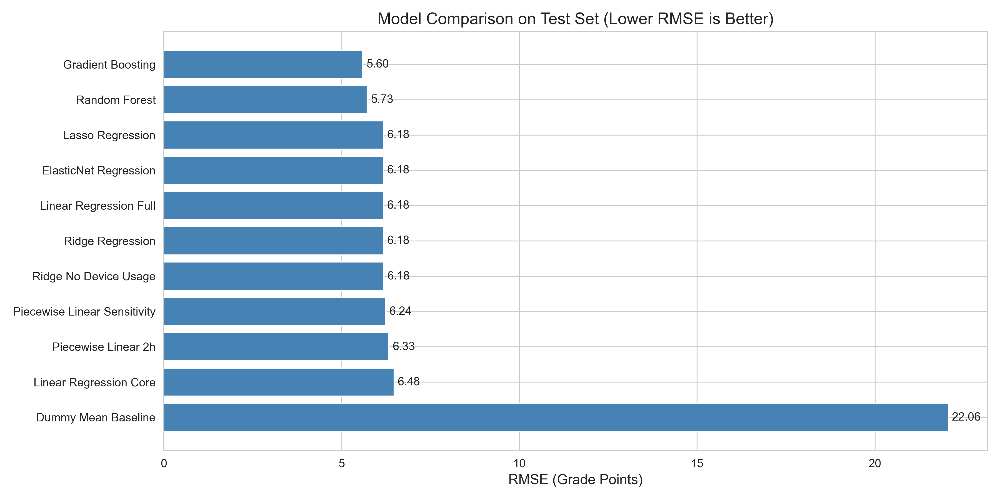
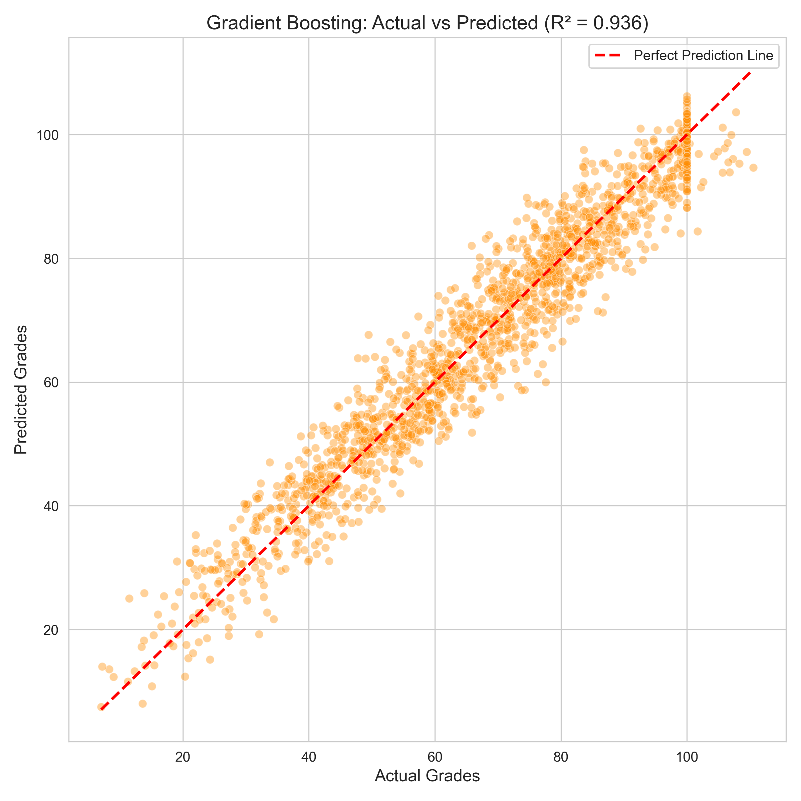
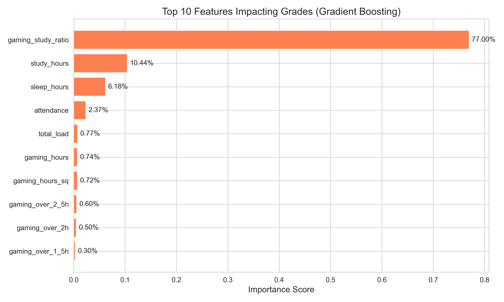
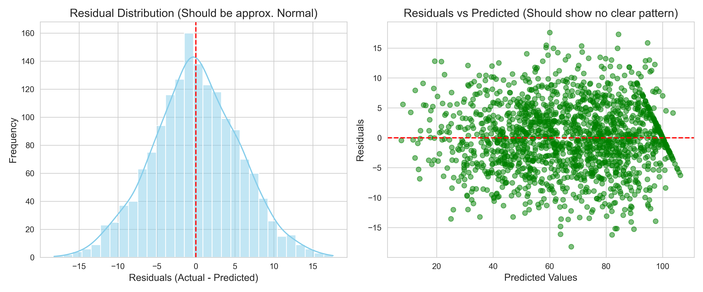
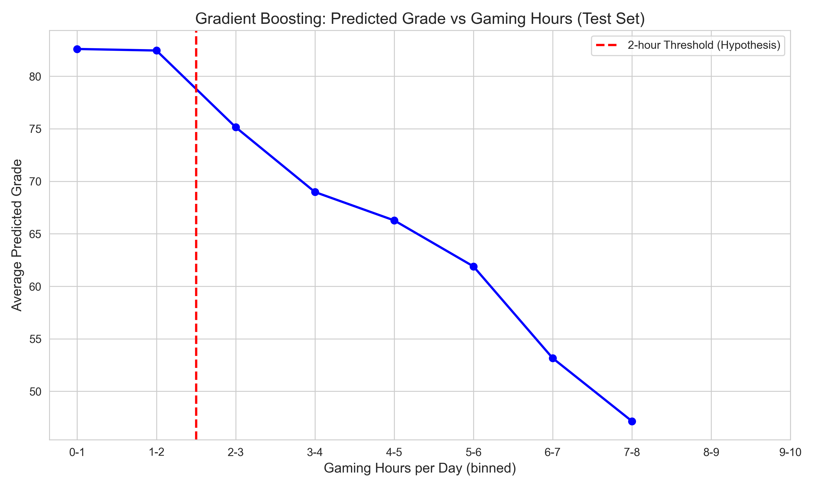

# Model Evaluation and Visualisation Report

## 1. Introduction

This notebook presents the final stage of the machine learning workflow, focusing on **model evaluation and result visualisation**. After completing data preprocessing and model training in previous notebooks, this stage aims to evaluate model performance, interpret prediction results, and analyse the reliability of the selected model.

The evaluation is conducted using multiple regression metrics and several visualisation techniques to ensure that the final model not only achieves good predictive performance but is also interpretable and reliable.

------

## 2. Evaluation Objectives

The objectives of this stage are:

- Compare the predictive performance of different regression models.
- Select the best-performing model using multiple evaluation metrics.
- Visualise prediction results on the testing dataset.
- Interpret the trained model through feature importance analysis.
- Assess model reliability using residual analysis.
- Summarise the relationship between gaming behaviour and academic performance.

------

# 3. Model Performance Comparison

To identify the most suitable prediction model, several regression algorithms were evaluated using three commonly used performance metrics:

- **RMSE (Root Mean Squared Error)** measures the average prediction error while assigning a larger penalty to larger errors.
- **MAE (Mean Absolute Error)** represents the average absolute difference between predicted and actual values.
- **R² (Coefficient of Determination)** measures how well the model explains the variance in the target variable.

Lower RMSE and MAE values indicate better prediction accuracy, while a higher R² value indicates stronger explanatory capability.

From the comparison results, the Gradient Boosting model achieves the lowest prediction error and the highest coefficient of determination. Therefore, it is selected as the final prediction model for subsequent analysis.

------

# 4. Prediction Accuracy on the Test Dataset

After selecting the optimal model, its predictive performance is evaluated on the unseen testing dataset.

The scatter plot compares the predicted academic performance with the actual values. Ideally, all observations should lie close to the diagonal reference line, indicating accurate predictions.

As shown in the figure, most prediction points are concentrated near the diagonal line, suggesting that the model produces accurate predictions with relatively small errors. Only a limited number of observations deviate noticeably from the ideal prediction line, indicating good generalisation performance.

------

# 5. Feature Importance Analysis

Besides prediction accuracy, understanding how the model makes decisions is equally important.

Feature importance analysis is conducted to identify which variables contribute most to predicting academic performance. Variables with higher importance scores have a stronger influence on the model output.

The feature importance results indicate that several behavioural variables contribute significantly to prediction performance. These findings improve the interpretability of the machine learning model and provide useful insights into the factors influencing academic performance.

------

# 6. Residual Analysis

Residual analysis is performed to evaluate whether systematic prediction errors exist.

Residuals are calculated as:

**Residual = Actual Value − Predicted Value**

An effective regression model should produce residuals that are randomly distributed around zero without obvious patterns.

The residual plot demonstrates that most residuals are randomly scattered around the zero line, suggesting that the model does not exhibit significant systematic bias. This indicates that the selected model is stable and reliable for prediction.

------

# 7. Relationship Between Gaming Behaviour and Academic Performance

To further explore the prediction results, visualisation is used to investigate the relationship between gaming behaviour and academic performance.

This analysis provides additional insight into how behavioural variables influence the predicted academic outcomes.

The visualisation reveals meaningful relationships between gaming-related variables and academic performance. Although the model captures these patterns effectively, it should be noted that machine learning identifies statistical associations rather than causal relationships.

------

# 8. Discussion

The evaluation results demonstrate that the selected model achieves strong predictive performance across multiple evaluation metrics. The prediction scatter plot, feature importance analysis, and residual diagnostics consistently support the effectiveness of the model.

Several strengths of the modelling approach can be identified:

- Multiple regression algorithms were systematically compared.
- Different evaluation metrics were considered during model selection.
- Visualisation improves the interpretability of prediction results.
- Feature importance analysis explains the contribution of individual variables.
- Residual analysis confirms the robustness of the final model.

However, several limitations should also be acknowledged:

- The model performance depends on the quality and representativeness of the available dataset.
- Some external factors affecting academic performance may not be included in the dataset.
- Feature importance reflects predictive contribution rather than causal influence.
- Future work could include larger datasets, additional behavioural features, and external validation.

------

# 9. Conclusion

This notebook completes the evaluation and interpretation of the machine learning models developed in this project.

Among the evaluated algorithms, the **Gradient Boosting** model demonstrates the best overall performance by achieving low prediction errors and a high coefficient of determination. Visual inspection of prediction accuracy, feature importance, and residual distribution further confirms the effectiveness and reliability of the selected model.

Overall, the evaluation indicates that the proposed modelling framework can effectively predict academic performance based on gaming behaviour while providing meaningful insights into the importance of different behavioural factors.

------

# Summary

- Compared multiple regression models.
- Selected the best-performing model using RMSE, MAE and R².
- Verified prediction accuracy on the testing dataset.
- Analysed feature importance for model interpretation.
- Evaluated residual behaviour to assess model reliability.
- Confirmed that the selected model provides accurate and reliable predictions.