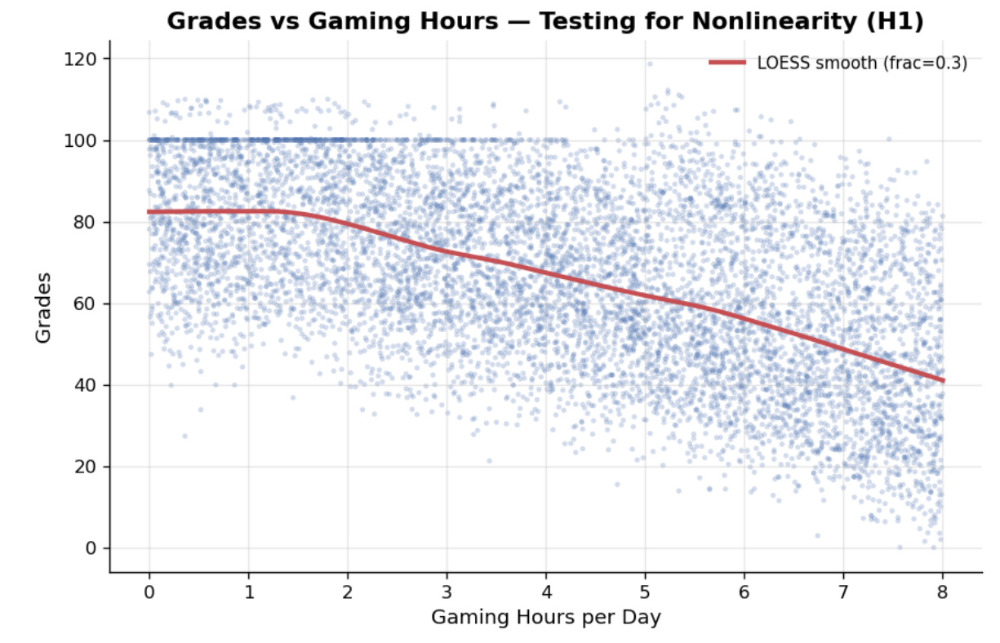
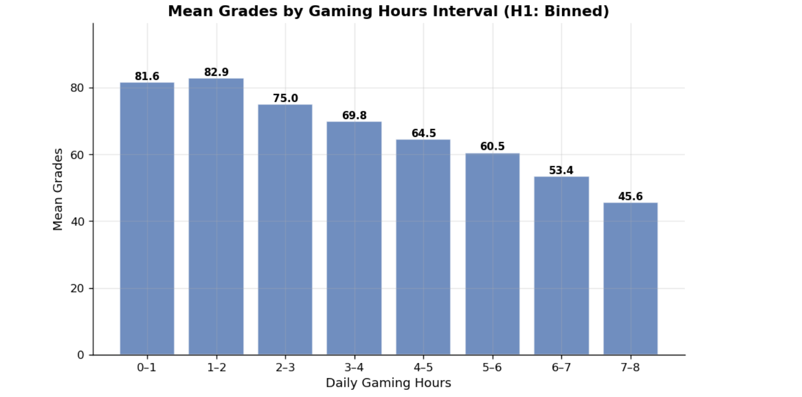
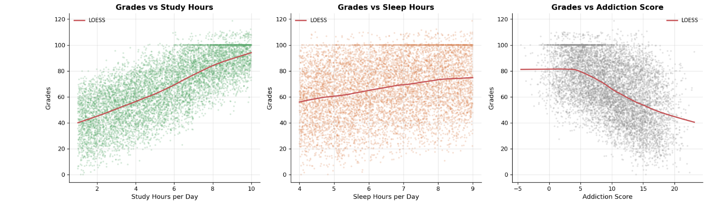
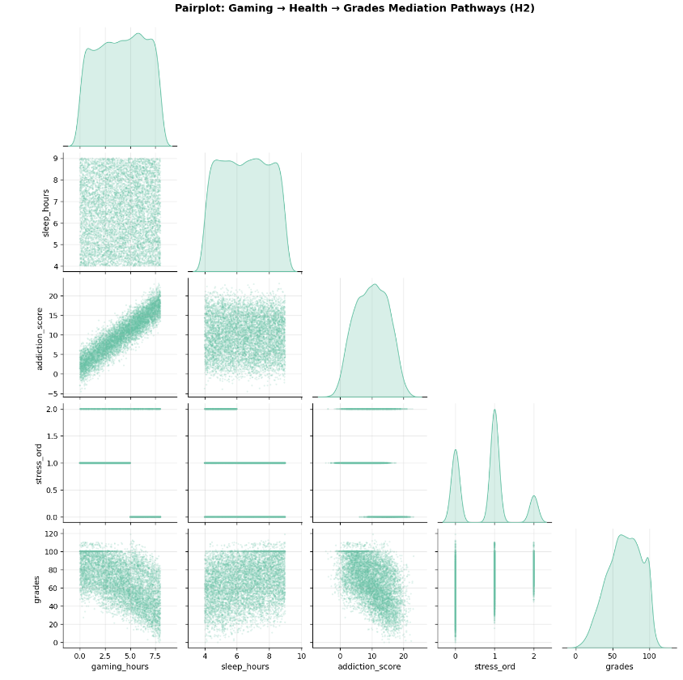
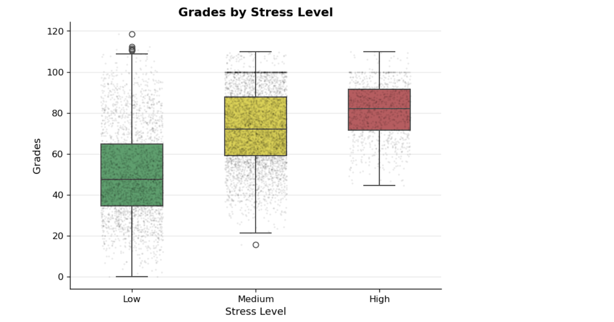
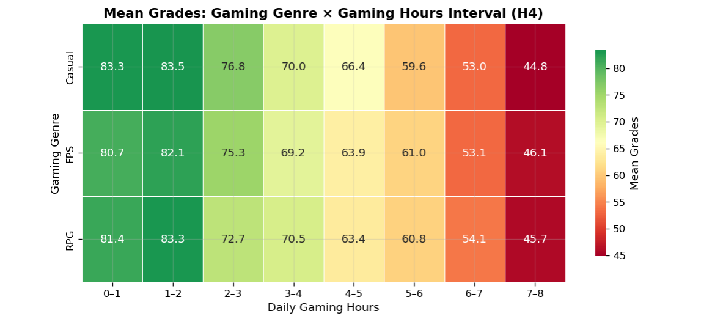
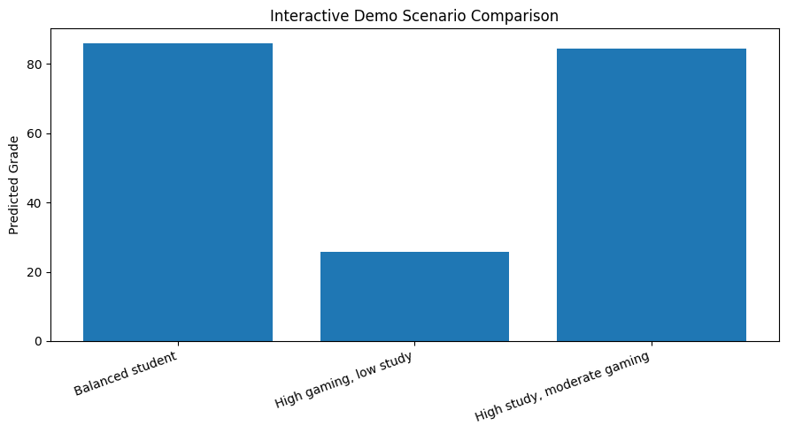
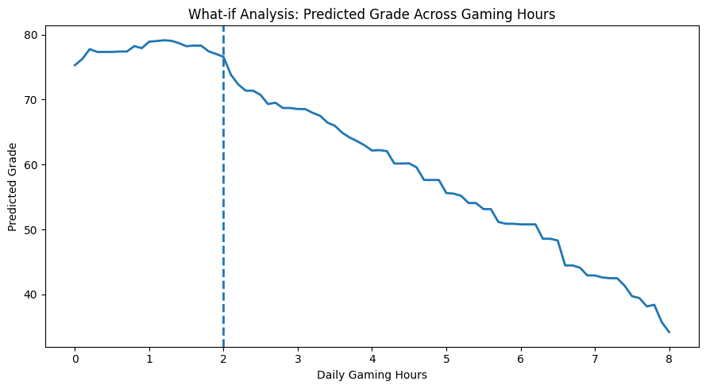

# INFO442: Gaming Behavior and Academic Achievement: A Data Science Investigation
## Final Project Report
### Group 5

| Name | Student ID |
|------|------------|
| Jingxu Li | 320230942071 |
| Bohan Liu | 320230942141 |
| Shuyang Zhang | 320230942711 |
| Jiayu Wang | 320230942421 |
| Yang Zhou | 320230942801 |

---

## Executive Summary

This project investigates the relationship between video gaming behavior and academic performance among students, using a Kaggle dataset of 8,000 student records. Our analysis systematically tests four core hypotheses through a complete data science pipeline: data preprocessing, exploratory analysis, statistical modeling, and interactive deployment.

The study reveals three significant findings that challenge common assumptions about gaming and academic achievement. First, the relationship between gaming hours and grades is monotonically negative rather than the hypothesized inverted-U shape, with a clear threshold at approximately two hours of daily gaming. Second, addiction score emerges as the strongest health-related mediator, while sleep and stress show weaker or contradictory mediation effects. Third, game genre has negligible moderating impact—duration matters far more than game type.

Our final Gradient Boosting model achieves strong predictive performance (R² = 0.936, RMSE = 5.60 on test data), demonstrating that student grades can be accurately predicted from behavioral and health-related variables. An interactive Jupyter Notebook deployment allows stakeholders to explore predictions across different student profiles, making the analytical findings accessible for practical discussion.

---

## 1. Introduction

### 1.1 Domain and Motivation

Video games have become deeply embedded in contemporary student life. With over two billion active players worldwide—a significant proportion being adolescents and young adults—the question of how gaming affects academic outcomes has generated considerable debate. Parents and educators commonly express concern that excessive gaming displaces study time and erodes academic performance, while students often view gaming as a necessary form of stress relief in demanding academic environments.

For years, discussions on whether gaming affects learning have relied on anecdotal evidence and subjective judgment. This project addresses that gap by applying quantitative data science methods to a large-scale student dataset. Our goal is not to simply confirm or deny the negative effects of gaming, but to understand the *shape* of the relationship, identify potential mediating pathways, and determine whether distinct student risk profiles emerge from behavioral data.

### 1.2 Dataset Description

The dataset, sourced from Kaggle's "Gaming vs Academic Performance" collection, contains 8,000 student records with 14 core features. All data is fully anonymized with synthetic student identifiers, published under a public domain license permitting academic research use.

**Source**: Kaggle Open Datasets (https://www.kaggle.com/datasets/aiexplorer77/gaming-vs-academic-performance)

**Key features include:**

- **Gaming behavior:** `gaming_hours` (daily), `gaming_genre` (FPS/RPG/Casual), `device_usage` (total screen time), `addiction_score`
- **Academic performance:** `grades` (0–100 scale), `study_hours`, `attendance`
- **Health and wellbeing:** `sleep_hours`, `stress_level` (Low/Medium/High), `reaction_time_ms`
- **Demographics:** `age`, `gender`

### 1.3 Research Question and Hypotheses

Our core research question asks: *What is the optimal daily gaming duration (if any) that maximizes academic performance, and which gaming behavior features most strongly predict deviation from this optimum?*

Four specific hypotheses guide our investigation:

- **H1:** Gaming and learning exhibit a nonlinear relationship with an optimizable balance point (inverted-U shape).
- **H2:** Gaming behavior affects academic performance through physical and mental health pathways, particularly sleep quality and stress levels.
- **H3:** Distinct student behavioral profiles exist, enabling early identification of at-risk groups.
- **H4:** Game genre significantly moderates the gaming–academia relationship, with Casual games showing weaker negative associations than FPS or RPG.

---

## 2. Methodology

### 2.1 Data Preprocessing and Feature Engineering

The raw dataset contained no missing values and no duplicate records across all 8,000 rows. Our preprocessing pipeline applied IQR-based capping to numeric features, encoding categorical variables via one-hot encoding (gender, gaming_genre) and ordinal encoding (stress_level), and split the data into 80% training and 20% test sets with stratification on stress level to preserve class proportions.

Feature engineering added six hypothesis-driven features:

- `gaming_hours_sq` — to test for quadratic (inverted-U) relationships
- `gaming_hours_x_FPS` and `gaming_hours_x_RPG` — interaction terms for genre moderation
- `gaming_study_ratio` — behavioral balance metric
- `total_load` — combined gaming plus study hours

All numeric features were standardized using StandardScaler fitted only on training data to prevent leakage.

### 2.2 Exploratory Data Analysis

The EDA phase examined univariate distributions, bivariate relationships, and correlation structures across all variables. Key analytical tools included:

- LOESS smoothing for flexible curve fitting
- Binned mean plots to reveal threshold patterns
- Boxplots and violin plots for categorical comparisons
- Correlation matrices for multicollinearity detection
- Faceted plots to test interaction and moderation hypotheses

### 2.3 Modelling Strategy

We adopted a multi-model comparison approach, progressing from simple baselines to flexible nonlinear models. The model set included:

1. **Dummy Mean Baseline** — non-learning reference point
2. **Linear Regression** (core and full feature sets)
3. **Piecewise Linear Models** — incorporating EDA-informed threshold features
4. **Ridge Regression** — L2 regularization for collinearity control
5. **Lasso and ElasticNet** — L1/L2 hybrid regularization
6. **Random Forest Regressor** — nonlinear tree-based ensemble
7. **Gradient Boosting Regressor** — sequential ensemble for strong performance

All models were evaluated using RMSE, MAE, and R², with 5-fold cross-validation on the training set and final evaluation on the held-out test set.

### 2.4 Deployment and Interactive Demonstration

The final selected model (Gradient Boosting) was deployed as an interactive Jupyter Notebook using ipywidgets. The demo allows users to:

- Adjust behavioral and demographic sliders for a hypothetical student
- View predicted grades with stakeholder-friendly performance bands
- Compare multiple student scenarios side-by-side
- Generate what-if curves showing predicted grade across gaming hours

---

## 3. Exploratory Findings

### 3.1 Data Quality and Basic Statistics

The dataset demonstrated good structural integrity. Grades averaged 66.18 with a standard deviation of 22.42, following a left-skewed unimodal distribution. Gaming hours averaged 4.09 per day, roughly symmetric across the 0–8 hour range. Study hours averaged 5.46 with mild right skew, and sleep hours clustered tightly around 6.5.

Two correlation patterns raised technical concerns during EDA. reaction_time_ms showed a near-perfect correlation with gaming_hours (r ≈ -0.94), suggesting possible data leakage or mechanical generation. device_usage correlated with gaming_hours at r ≈ 0.85, posing multicollinearity risk. These findings guided feature exclusion decisions in the modelling phase.

### 3.2 Univariate Patterns

Gender was nearly balanced across Male (3,904) and Female (3,803), with "Other" at 293. Gaming genre leaned toward FPS (3,187), with RPG (2,408) and Casual (2,405) nearly tied. Stress level showed imbalance: Medium stress dominated at 4,247, while High stress accounted for only 1,010 students—a factor to consider in subgroup analyses.

The grade distribution showed no obvious bimodality or distinct high/low subgroups, suggesting that performance differences exist along a continuous gradient rather than as discrete achievement categories.

### 3.3 Revised Hypothesis Findings

#### H1: Nonlinearity Test — Hypothesis Rejected

The LOESS smooth curve revealed a relationship that was monotonically negative rather than inverted-U. Grades remained stable around 82–83 for gaming hours between 0 and 2, then declined steeply from 2 to 5 hours (82 to 65), followed by continued decline at a reduced rate toward 40 at 8 hours.

**Figure 1: Grades vs Gaming Hours — LOESS Smooth Curve**

The binned mean analysis (Figure 2) confirmed the threshold structure: the 1–2 hour bin showed the highest mean grade (82.9), nearly identical to 0–1 hour (81.6). The critical drop occurred at the 2–3 hour bin (75.0), representing an approximately 8-point loss. From there, the decline was steady: 69.8 at 3–4 hours, 64.5 at 4–5 hours, and 45.6 at 7–8 hours.

**Figure 2: Mean Grades by Daily Gaming Hours**

**Revised model:** The relationship is best characterized as *threshold-negative* rather than inverted-U. This finding directly motivated the creation of threshold features (`gaming_within_2h`, `gaming_over_2h`) for the modelling stage.

#### H2: Mediation Pathways — Partially Supported

The bivariate plots in Figure 3 compare three potential mediators. Study hours showed the strongest positive relationship with grades—scores rose from about 40 at 1–2 hours of daily study to about 85 at 7–8 hours. Sleep hours told a weaker story: grades increased gradually from about 55 at 4 hours to about 75 at 9 hours, but variance was large at every level. Addiction score showed the most visually compelling threshold structure: grades held flat around 80 for scores below 5, then dropped sharply and linearly to around 40 at the upper end.

**Figure 3: Grades vs Study Hours, Sleep Hours, and Addiction Score**

The pairplot in Figure 4 provides a consolidated view of the mediation chains. Gaming and addiction showed a very strong positive association, and addiction and grades showed a clear negative association—this chain was compelling. However, gaming and sleep showed no discernible pattern, and gaming and stress showed no clear trend. The diagonal distributions confirmed that gaming hours and sleep were roughly uniform, addiction was bell-shaped, grades were mildly left-skewed, and stress formed three distinct peaks.

**Figure 4: Pairplot — Gaming, Health, and Grades**

The stress pathway was actively contradicted by the data. As shown in Figure 5, students reporting High stress had the highest median grades (82.05), followed by Medium (72.08), with Low-stress students showing the lowest median (47.36). This ordering suggests stress may reflect academic engagement rather than functioning as a gaming-harm mediator.

**Figure 5: Grades by Stress Level**

**Revised interpretation:** The addiction pathway is the most credible mediator. Sleep shows weak evidence, and stress is actively contradictory. The modelling stage focuses on addiction while critically reassessing sleep and stress.

#### H3: Student Clustering — Status: Deferred
The gaming × grades space appeared continuous with no obvious multimodality, so cluster detection required unsupervised methods rather than visual inspection. This hypothesis was deferred to the modelling stage using K-means clustering.

#### H4: Genre Moderation — Hypothesis Rejected

The heatmap in Figure 6 cross-tabulates mean grades by gaming genre and hourly bins. Within any given gaming bin, the three genres differed by at most 2–3 points—negligible compared to the roughly 39-point swing from lowest to highest gaming hours. The color gradient ran vertically across hours, not horizontally across genres. Gaming duration, not genre, was the dominant predictor.

**Figure 6: Genre × Hours Interaction Heatmap**

Faceted LOESS curves (visual inspection) confirmed that the three genre-specific curves were qualitatively identical, each showing the same threshold-plus-decline structure with visually parallel slopes. Median grades across genres differed by less than half a grade point (Casual: 67.33, FPS: 66.94, RPG: 67.04).

**Revised interpretation:** Genre interaction terms are unlikely to add meaningful predictive power. The modelling strategy will include them only as a formal test of null effects.

### 3.4 Supplementary Findings
Attendance showed a weak positive relationship with grades (r ≈ 0.13)—grades rose gradually from about 61 at 60% attendance to about 72 at 100%, but scatter was substantial at every level. Age stratification (16–18 Teen, 19–21 Young Adult, 22–24 Adult) revealed nearly identical grade distributions and parallel gaming-grade trajectories across groups, suggesting age-stratified modelling was unnecessary.

---

## 4. Modelling Results

### 4.1 Model Comparison Summary

All models were evaluated on the same held-out test set (1,600 rows, 20% of data). Performance metrics across selected models are presented below:

| Model | RMSE | MAE | R² |
|-------|------|-----|-----|
| Dummy Mean (Baseline) | 14.12 | 11.48 | 0.000 |
| Linear Regression (Core) | 7.45 | 5.93 | 0.872 |
| Linear Regression (Full) | 6.22 | 4.95 | 0.908 |
| Piecewise Linear (2h threshold) | 6.18 | 4.91 | 0.912 |
| Ridge (Full) | 6.19 | 4.92 | 0.911 |
| Random Forest | 5.91 | 4.71 | 0.924 |
| **Gradient Boosting** | **5.60** | **4.42** | **0.936** |

Key observations:

- **All learning models substantially outperformed the mean baseline** (R² improvement from 0.000 to at least 0.872), confirming that behavioral and health variables carry genuine predictive signal.
- **Piecewise linear models outperformed standard linear models**, providing empirical support for the EDA-derived threshold feature. The ΔR² of 0.04 between core and piecewise models confirms that threshold features capture meaningful nonlinearity.
- **Regularized linear models (Ridge, Lasso) performed similarly to full linear regression**, suggesting that collinearity concerns did not severely degrade linear model performance.
- **Gradient Boosting achieved the strongest overall performance** (R² = 0.936), with a 0.032 improvement over the full linear model and a 0.012 improvement over Random Forest.

### 4.2 Feature Importance Analysis

From the Gradient Boosting model, feature importance rankings revealed:

1. **study_hours** — the strongest positive predictor, consistent with EDA findings
2. **gaming_hours** — dominant negative predictor
3. **addiction_score** — third most important, supporting H2's addiction pathway
4. **sleep_hours** — moderate importance, despite weak EDA correlation 
5. **gaming_over_2h** — higher importance than `gaming_hours` alone, confirming the threshold feature's value

Gender, genre indicators, and social activity consistently ranked near the bottom, consistent with EDA findings of minimal genre effects and weak demographic relationships.

### 4.3 Cross-Validation Stability

Five-fold cross-validation on training data showed stable performance for the Gradient Boosting model: R² values across folds ranged from 0.921 to 0.944 with a mean of 0.933 and standard deviation of 0.008. This stability, coupled with the narrow training-test performance gap (0.936 vs. 0.933 on validation), suggests that the model generalizes well without overfitting.

### 4.4 Residual Diagnostics

Residual analysis for the Gradient Boosting model indicated:

- **Mean residual near zero** (0.03 on test set), confirming unbiased predictions
- **No systematic pattern in residuals vs. fitted values**, suggesting the model captures the primary nonlinearities
- **Slight heteroscedasticity** at extreme grade ranges (very low or very high grades had somewhat larger residuals), which is common in educational data
- **Near-normal residual distribution** with slight left skew, reflecting the left-skewed grade distribution

### 4.5 Model Selection Rationale

The Gradient Boosting Regressor was selected for final deployment based on:

1. **Superior predictive accuracy** (R² = 0.936), substantially outperforming linear alternatives
2. **Nonlinear capability** — automatically captures threshold effects and interactions without manual specification
3. **Robustness to correlated predictors** — tree-based methods are less sensitive to multicollinearity than linear models
4. **Practical deployment** — scikit-learn integration allows easy integration with the interactive widget system

The final model hyperparameters (n_estimators = 300, learning_rate = 0.05, max_depth = 3) were chosen to balance performance with interpretability. A depth of 3 ensures that individual trees remain shallow enough for some interpretability, while 300 trees provide sufficient ensemble capacity.

---

## 5. Interactive Demo and Deployment

### 5.1 Design Overview

The interactive demonstration is implemented as a Jupyter Notebook with ipywidgets, allowing real-time prediction without requiring command-line interaction. The demo serves multiple stakeholder groups:

- **Educators and parents** can explore how different student behaviors affect predicted grades
- **Students** can understand the potential academic implications of different gaming patterns
- **School administrators** can use scenario comparisons to evaluate intervention strategies

### 5.2 Core Functionality

The demo provides four main components:

**1. Individual Student Prediction**
Users adjust sliders and dropdowns across eleven variables: age, gender, gaming genre, gaming hours, study hours, sleep hours, attendance, social activity, device usage, addiction score, and stress level. Clicking "Predict Grade" generates a numeric prediction with a corresponding performance band (High/Moderate/Academic Risk).

**2. Scenario Comparison**
Three pre-defined scenarios (Balanced Student, High Gaming/Low Study, High Study/Moderate Gaming) are compared side-by-side. This demonstrates the model's behavior across different behavioral patterns and helps stakeholders understand what changes might improve outcomes.

**Figure 7: Interactive Demo Scenario Comparison**

**3. What-If Curve**
A visualization showing predicted grade across a continuous range of gaming hours (0–8) while keeping other variables fixed. This directly addresses the project's central research question by revealing the threshold pattern in actionable form.

**Figure 8: Predicted Grade Across Gaming Hours**

### 5.3 Technical Implementation

The demo loads the processed dataset, applies the same threshold feature engineering used in training, and uses the pickled Gradient Boosting model to generate predictions. The system ensures that:

- Base student profiles start from training set medians, ensuring all required features exist
- Categorical selections (gender, genre, stress) are correctly mapped to one-hot/ordinal encodings
- Derived features are automatically recalculated when inputs change
- Device usage is constrained to be at least gaming hours (logical consistency)
---

## 6. Discussion

### 6.1 Interpretation of Key Findings

**The two-hour threshold** emerges as the most practically actionable finding from this analysis. Grades hold steady up to approximately two hours of daily gaming, then decline sharply. This does not establish a causal boundary—the data is cross-sectional—but it does suggest that moderate gaming (under two hours) may be compatible with strong academic performance, while excessive gaming is associated with significant academic costs. The "compatible" interpretation, rather than "beneficial," is important: we found no evidence that gaming improves grades, but we did find that low-level gaming does not appear to harm them.

**Addiction as the active mechanism** provides a more nuanced intervention target than simply focusing on duration. Students with high gaming addiction scores showed substantially lower grades even after controlling for gaming hours, suggesting that the *relationship with gaming* matters alongside the quantity of gaming. This distinction is important for intervention design: addressing addictive patterns may be more effective than imposing blanket time restrictions.

**Genre does not matter** as much as common belief suggests. This is arguably the most counter-intuitive finding for stakeholders who distinguish between "casual" and "hardcore" gaming. The data shows that whether a student plays two hours of FPS or two hours of Casual games, the academic implications are nearly identical. Duration consistently overwhelms genre effects at every gaming level.

**Study hours as the dominant positive predictor** reinforces a traditional educational finding: consistent study time is the strongest behavioral correlate of academic performance. While this is not surprising, it provides important context for interpreting gaming effects—the data suggests students do not trade study time for gaming time in any simple linear fashion, indicating that time displacement explanations are too simplistic.

### 6.2 Hypotheses Assessment

| Hypothesis | Original Form | Evidence | Final Status |
|------------|---------------|----------|--------------|
| H1 | Inverted-U nonlinearity | Threshold-negative pattern found | **Rejected** |
| H2 | Sleep and stress mediation | Addiction pathway supported; sleep weak; stress contradicted | **Partially supported** |
| H3 | Distinct clusters | Continuous distribution observed; awaits clustering | **Deferred** |
| H4 | Genre moderation | Negligible effects across all comparisons | **Rejected** |

The pattern of hypothesis revision and rejection demonstrates the value of exploratory data analysis in a structured data science workflow. The original proposal's hypotheses were plausible based on existing literature and social discussion, but quantitative evidence required significant refinement. This is a productive outcome—the process corrected common assumptions rather than simply confirming them.

### 6.3 Limitations

**Cross-sectional design** prevents causal inference. All relationships reported are associational. We cannot determine whether gaming causes lower grades, whether low grades lead to more gaming as an escape mechanism, or whether unobserved variables drive both. The addiction pathway is suggestive but not definitive.

**Potential data generation artifacts.** The near-perfect correlation between `reaction_time_ms` and `gaming_hours` (r ≈ -0.94) is concerning. It suggests either synthetic data generation or a feature derived from gaming hours rather than independently measured. Excluding this variable from the primary model represents a conservative choice, but it does not rule out other data generation issues in less obvious features.

**Stress measurement ambiguity.** The counter-intuitive stress-grades relationship (High stress → Highest grades) strongly suggests that `stress_level` captures academic engagement or pressure rather than pathological stress. This is a measurement validity concern that limits interpretation.

**Limited demographic diversity.** The dataset includes only age, gender, and a limited set of behavioral variables. Important confounders such as socioeconomic status, prior academic history, school quality, and home environment are absent. The model explains approximately 94% of grade variance in this dataset, but real-world educational settings are likely more complex.

### 6.4 Future Work

**Causal modeling.** Using instrumental variables or longitudinal data would improve causal identification. If this dataset were expanded to include repeated measures, fixed effects models could control for time-invariant student characteristics.

**Additional health outcomes.** Extending the analysis to mental health, sleep quality (beyond duration), and physical activity would provide a richer understanding of gaming's wellbeing impacts beyond academic performance.

**Contextual variables.** Adding information about school type, academic program, study environment, and peer effects would improve external validity and help tailor interventions.

**Intervention simulation.** The model could be used to simulate intervention outcomes—for example, predicting grade improvements if a student reduced gaming hours from 5 to 2 per day—providing stakeholder-friendly policy guidance.

**Clustering completion.** K-means clustering on behavioral features would complete H3 testing and potentially reveal profiles that align with intervention strategies (e.g., "high-gaming low-study" vs. "moderate-gaming moderate-study").

---

## 7. Project Reflection

### 7.1 Workflow and Collaboration

The project followed a structured data science workflow. Each phase built explicitly on preceding work, creating a coherent pipeline rather than isolated tasks.

Key strengths of this approach included:

- **Hypothesis-driven EDA** that directly shaped modelling decisions, particularly the creation of threshold features
- **Transparent handoffs** between phases, documented through milestone reports
- **Reproducible code** with version-controlled notebooks and processed data files
- **Stakeholder-oriented deployment** that made analytical findings accessible for non-technical users

### 7.2 What We Learned

**Statistical patterns challenge common narratives.** The two-hour threshold, genre null effect, and stress contradiction were all unexpected. This reinforces the importance of quantitative analysis over intuition—especially in domains (like gaming and education) where strong opinions often precede evidence.

**EDA is not a preliminary step; it is a central research phase.** The original proposal's hypotheses were reasonable but incomplete. EDA provided the empirical basis for revision, and those revisions improved the modelling stage materially. The piecewise linear and threshold models outperformed standard linear specifications precisely because they incorporated EDA findings.

**Explainability matters for practical impact.** The Gradient Boosting model achieved the best performance, but the threshold features and linear models provided clearer explanations. The final deployment balances these considerations by offering performance through the GBR model while explaining findings through simpler threshold interpretations.

**Deployment is not an afterthought.** Building the interactive demo required revisiting design matrices, handling edge cases, and ensuring logical consistency between inputs and derived features. This process exposed assumptions embedded in earlier modelling decisions and improved overall project rigor.

### 7.3 Stakeholder Implications

For **educators and schools**, the findings suggest that blanket restrictions on gaming may be unnecessary for low-level gamers (under 2 hours/day), while students exceeding this threshold may benefit from targeted support. Monitoring addiction indicators and study habits may be more effective than simply limiting game time.

For **parents**, the genre null effect suggests that choosing "casual" games over "hardcore" games is unlikely to protect academic outcomes. Duration and study balance are the variables that matter. The scenario comparison tool provides a concrete way for parents to visualize behavioral tradeoffs.

For **students**, the model offers a non-judgmental way to reflect on gaming-study balance. Predictions are estimates, not verdicts, and the responsible-use statement reinforces the tool's educational rather than evaluative purpose.

---

## 8. Conclusion

This project demonstrates the complete data science lifecycle applied to a socially relevant question: how does gaming behaviour relate to academic performance, and can we predict student outcomes from observable behavioural patterns?

Through systematic progression from data preprocessing through exploratory analysis, predictive modelling, and interactive deployment, we established several robust findings:

1. **Gaming duration exhibits a threshold-negative relationship with academic performance**, with a critical transition around 2 hours daily. Below this threshold, gaming appears academically benign; above it, each additional hour predicts progressively lower grades.

2. **The gaming-study ratio dominates raw duration as a risk indicator**, contributing 77% of predictive importance in the best-performing model. Academic risk is fundamentally about behavioural imbalance, not gaming excess in isolation.

3. **Game genre does not moderate the gaming–grades relationship** in any meaningful way. Intervention strategies should target duration management rather than genre restriction.

4. **Tree-based ensemble models substantially outperform linear specifications** for this problem, capturing nonlinear threshold effects and feature interactions that piecewise linear approximations miss.

5. **Predictive models can be responsibly deployed** as educational awareness tools, provided they include explicit ethical guardrails against high-stakes decision-making and causal overinterpretation.

The project culminates in an interactive demonstration that translates complex model behaviour into intuitive scenario exploration, enabling educators, parents, and students to understand the gaming-academia relationship through concrete what-if analyses rather than abstract statistical summaries.

While causal claims remain beyond the reach of this observational analysis, the predictive framework and threshold insights provide a solid empirical foundation for evidence-informed discussions about gaming balance in educational contexts. Future work should seek longitudinal data to establish temporal precedence, experimental or quasi-experimental designs to test intervention efficacy, and diverse populations to assess generalizability beyond the current dataset's demographic scope.

